AWS에 처음 가입하면, 프리티어 12개월 무료 사용권을 준다.

이 사용권을 이용해 AWS 배포를 해보자!

​	

## 1. 회원가입하기

[Amazon Web Services](https://aws.amazon.com/ko)

위 링크에 접속하여 AWS 회원가입을 한다.

회원가입할 때, 해외결제가 가능한 카드가 꼭 필요하다!

회원가입 하는법은 생략하겠다 ㅎㅎ..

회원가입 후 로그인을 하면 이런 페이지가 보인다.

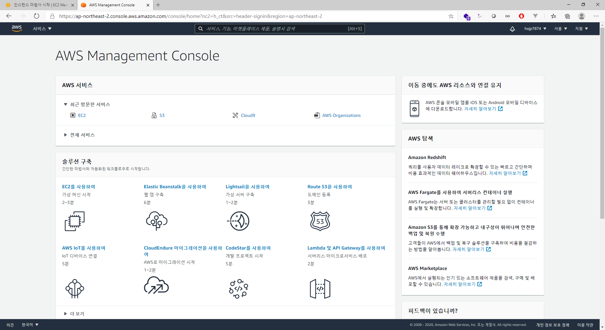

​	

## 2. EC2 인스턴스 생성하기

상단의 검색창에 `EC2`라고 검색한다.

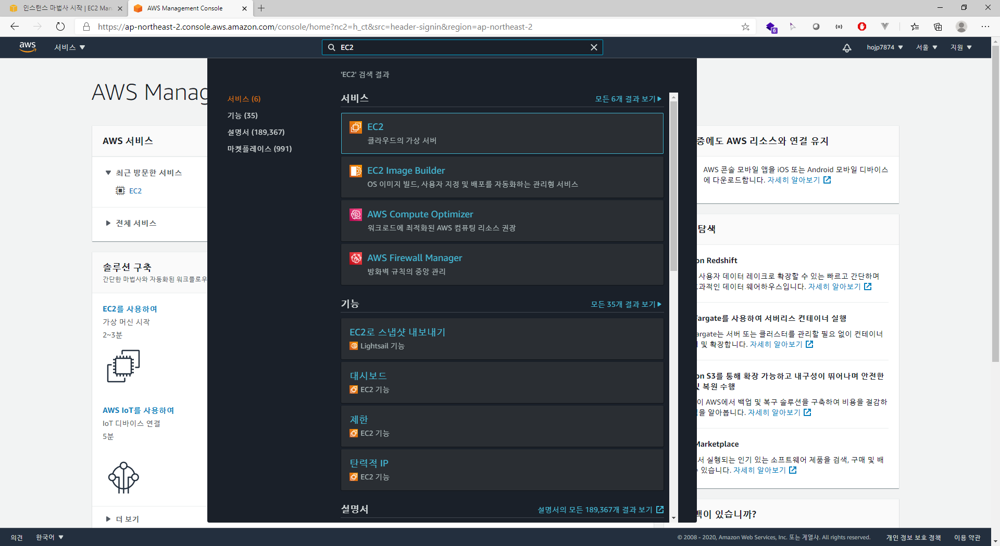

​	

EC2를 선택하면 아래와 같이 나온다.

​	

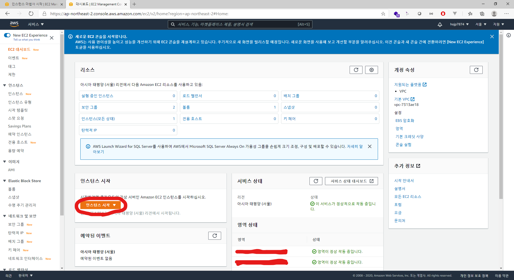

​	

인스턴스 시작 클릭!

​	

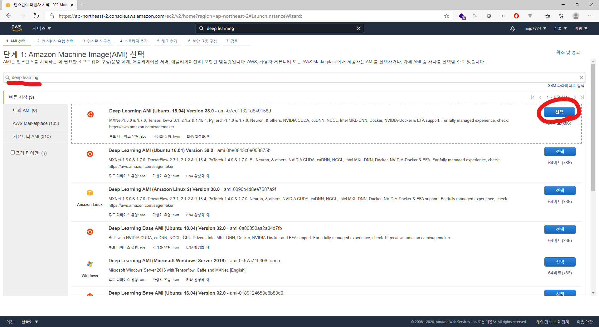

​	

deep learning을 검색하고 선택을 누른다.

​	

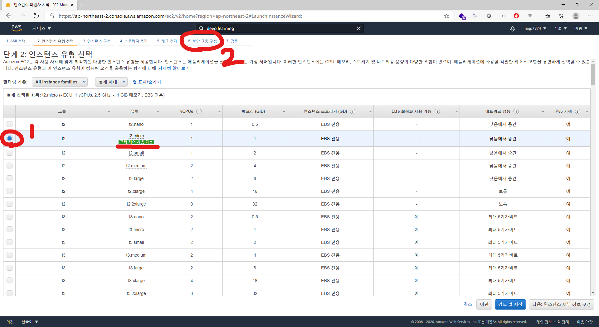

​	

프리티어 사용 가능한 `t2`유형을 선택하고 6번 `보안 그룹 구성`으로 넘어간다.

​	

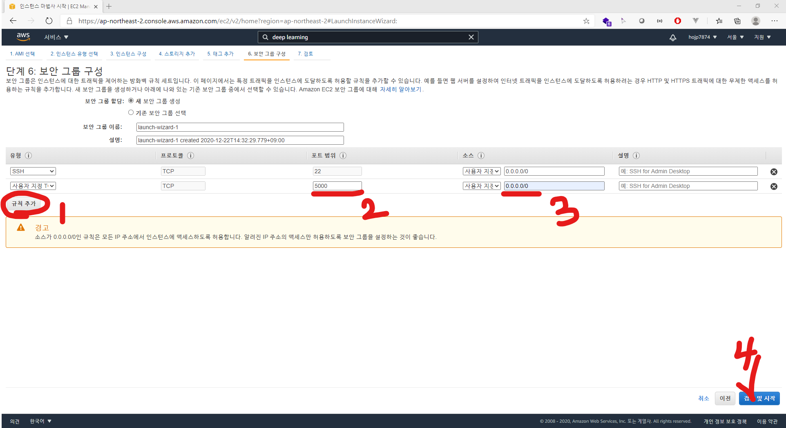

​	

위와 같이 작성한 후 검토 및 시작을 누른다.

​	

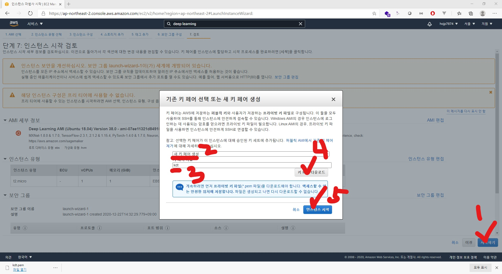

​	

인스턴스 시작 전 보안 경고문이 뜨는데, 지금은 간단한 테스트 프로젝트이므로 무시하고 넘어간다.

위의 순서대로 진행하면 키페어가 다운로드되고 인스턴스가 시작된다.

​	

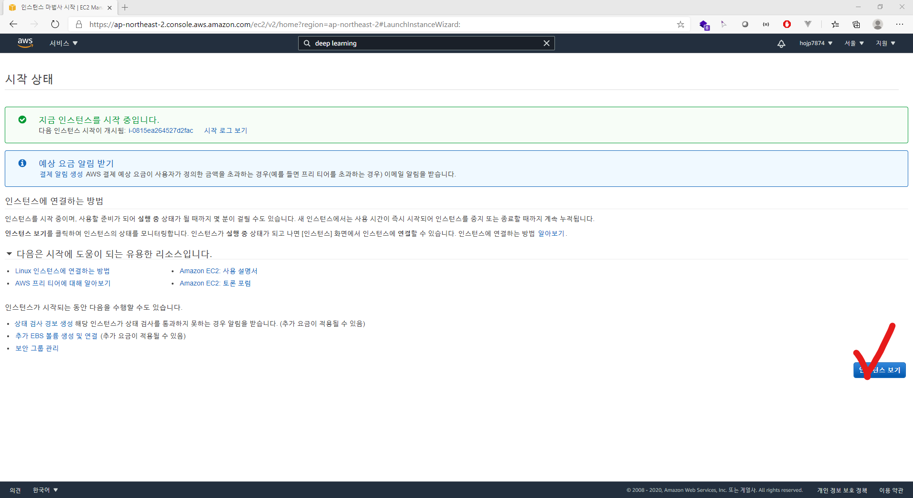

​	

인스턴스 보기를 누르면 아래와 같이 실행중인 인스턴스가 나타난다.

​	

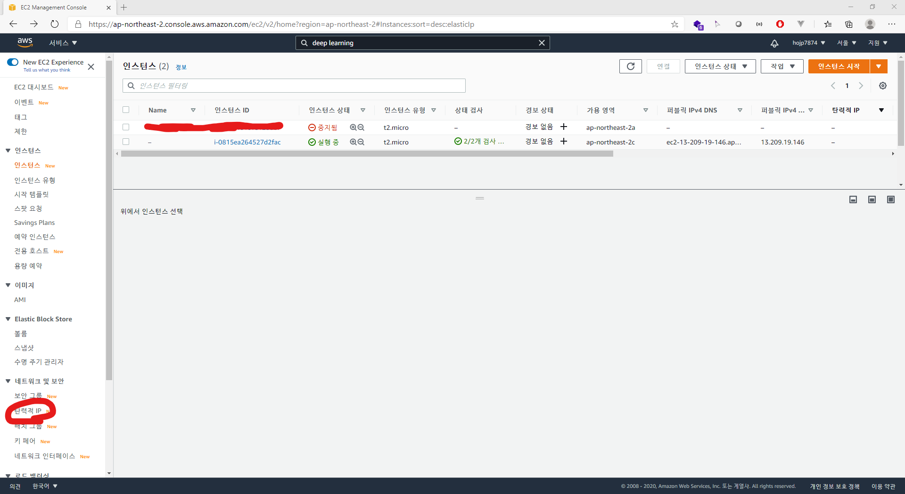

​	

위에 중지된 인스턴스는 예전에 하던거..

여기까지 하면 인스턴스 생성이 완료되었다.

그러나 인스턴스가 재생성 될때마다 IP주소가 바뀐다.

그래서 IP를 고정시켜주기 위해 `탄력적 IP`를 사용하는데.. 과금이 발생한다.

일단 하는 방법을 알아보자.

​	

## 3. 탄력적 IP 사용하기

위 그림에서 좌측 아래 `탄력적 IP`를 클릭한다.

​	

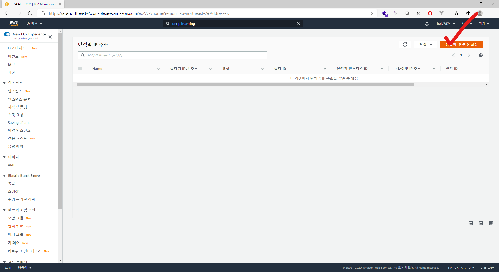

​	

우측 상단 `탄력적 IP 주소 할당`을 클릭한다.

​	

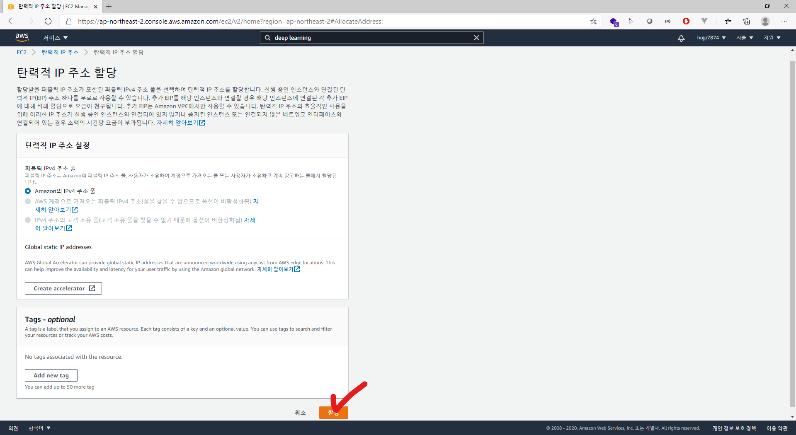

​	

IP주소 하나는 무료로 사용할 수 있네요.

​	

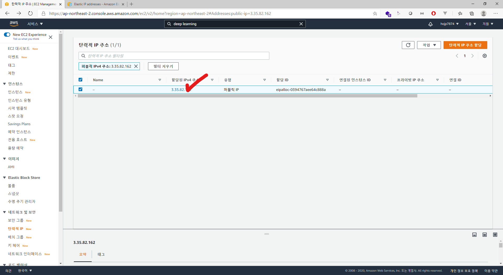

​	

이제 IP주소를 생성했으니 연결을 하겠습니다.

​	

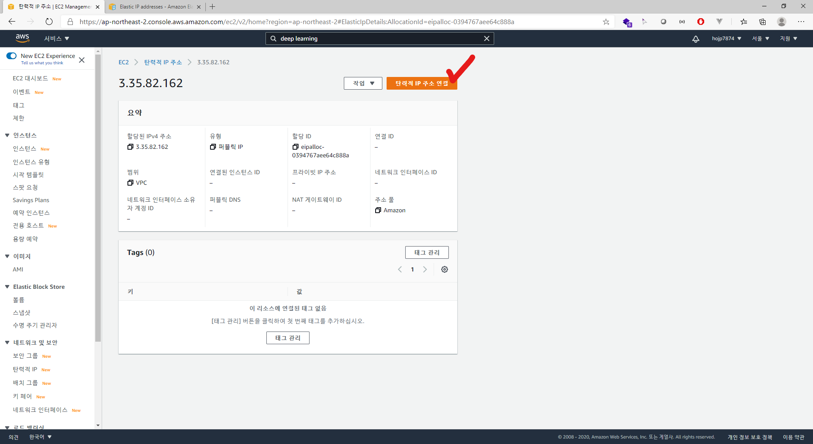

​	

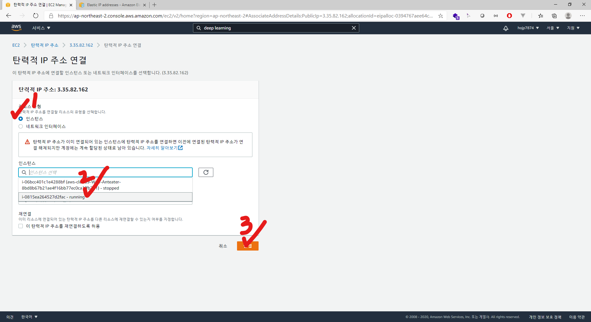

​	

인스턴스에 방금 생성한 인스턴스를 연결하면 됩니다.

​	

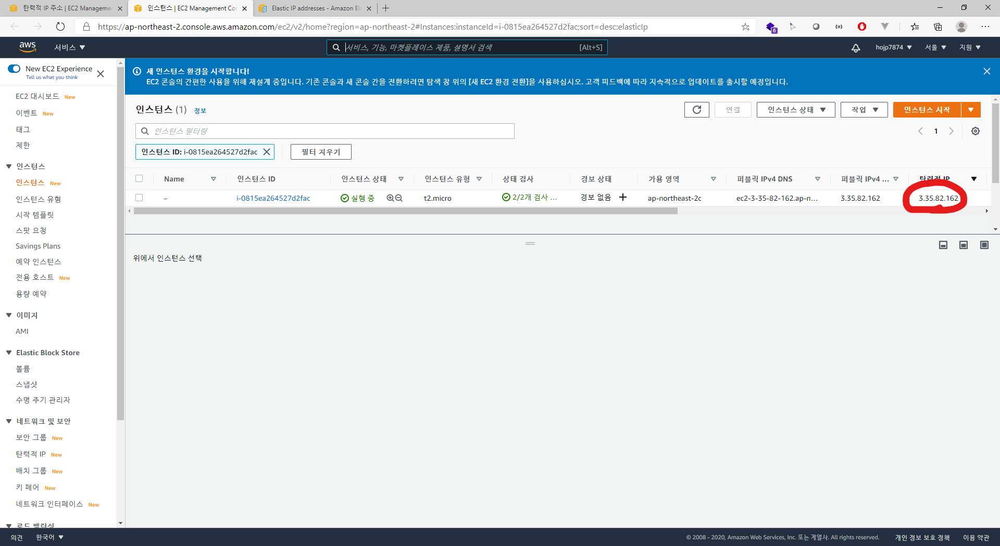

​	

완료!

​	

## 4. 인스턴스 연결 초기화

인스턴스 페이지에 들어오면 우측 상단에 연결 버튼이 있습니다.

​	

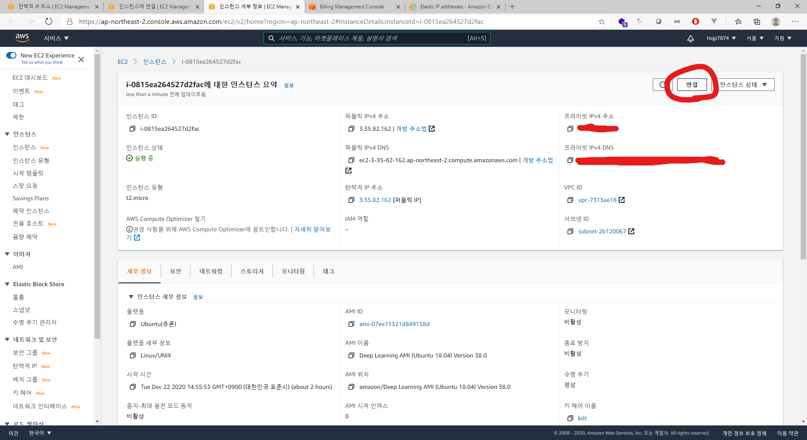

​	

이걸 누르면 SSH 클라이언트로 인스턴스에 연결하는 가이드가 나타납니다.

mac 쓰는 사람은 그냥 진행하면 되는데..

전 window이기 때문에 고생좀 해야합니다. ㅜㅜ

​	

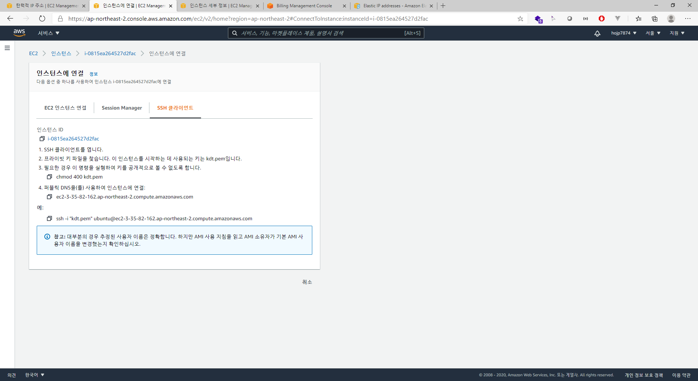

​	

1. SSH 클라이언트를 엽니다.

   일단 1번부터 막혔네요. SSH 클라이언트를 연다니?

   다행히 window10에는 SSH 클라이언트를 실행할 수 있습니다.

   cmd창에 아래와 같이 적으면 설치 끝!

   ```shell
   Add-WindowsCapability -Online -Name OpenSSH.Client~~~~0.0.1.0
   ```

2. 프라이빗 키 파일을 찾습니다. 이 인스턴스를 시작하는 데 사용되는 키는 `kdt.pem`입니다.

   아까 받아놓은 프라이빗 키를 찾아서 임의의 폴더에 넣어둡니다.

3. 필요한 경우 이 명령을 실행하여 키를 공개적으로 볼 수 없도록 합니다. 

   여기서 가이드에 나와있는 명령어인 `chmod`는 window에서는 사용할 수 없으므로 다른 방법을 사용해야 합니다.

   2번에서 생성한 `폴더 우클릭 -> 속성 -> 보안 탭 -> 고급 -> 상속 사용 안함`

4. 퍼블릭 DNS을(를) 사용하여 인스턴스에 연결:

   키가 들어있는 폴더에서 cmd를 켜고, 가이드에 나와있는 명령어를 입력합니다.

   ```shell
   ssh -i "kdt.pem" ubuntu@ec2-3-35-82-162.ap-northeast-2.compute.amazonaws.com
   ```

   ​	

그러면... 

```shell
ssh: connect to host ec2-13-209-89-56.ap-northeast-2.compute.amazonaws.com port 22: Connection timed out
```

에러가 뜬다.

인스턴스를 새로 만들어도 같은 오류가 반복됩니다.

...

...

AWS에서 방화벽이 하나 더 생겼던지, 서버 통신상태가 좋지 않았던지 등의 문제가 있었나봅니다.

시간이 흐른 뒤 새로운 다시 연결해보니 진전이 있습니다.

​	

```shell
@@@@@@@@@@@@@@@@@@@@@@@@@@@@@@@@@@@@@@@@@@@@@@@@@@@@@@@@@@@
@    WARNING: REMOTE HOST IDENTIFICATION HAS CHANGED!     @
@@@@@@@@@@@@@@@@@@@@@@@@@@@@@@@@@@@@@@@@@@@@@@@@@@@@@@@@@@@
IT IS POSSIBLE THAT SOMEONE IS DOING SOMETHING NASTY!
Someone could be eavesdropping on you right now (man-in-the-middle attack)!
It is also possible that a host key has just been changed.
The fingerprint for the ECDSA key sent by the remote host is
SHA256:kFc7OLRofTQSdo4dslsvetzDcO6WTLytpahC9SVmw5A.
Please contact your system administrator.
Add correct host key in C:\\Users\\hojp7/.ssh/known_hosts to get rid of this message.
Offending ECDSA key in C:\\Users\\hojp7/.ssh/known_hosts:1
ECDSA host key for ec2-3-35-82-162.ap-northeast-2.compute.amazonaws.com has changed and you have requested strict checking.
Host key verification failed.
```

​	

에러의 형태가 바뀌었습니다.

연결 호스트 신원이 변경되었다고 하는데...

퍼블릭 IP (탄력적 IP)를 새로 만들었기 때문에 발생 것 같네요.

SSH는 처음 접속할 때 접속한 서버의 IP(에 해당되는 퍼블릭 key와 프라이빗 key)를 기억하는데, 퍼블릭 IP가 바뀌어서 키가 안맞는 상태입니다.

새로 키를 만들어줘야겠어요.

```shell
ssh-keygen -R [ IP or DomainName]
```

이 명령어는 IP에 해당되는  퍼블릭 key와 프라이빗 key 쌍을 만들어주는 명령어입니다.

이 후 다시 인스턴스 연결을 시도하면,

```shell
Are you sure you want to continue connecting (yes/no)?
```

__yes__ 를 입력하면 접속됩니다.

접속이 되는걸 확인하면, 이제 vscode에서 접속할 수 있도록 해줍니다. 왜냐하면 cmd는 불편하니까요!

​	

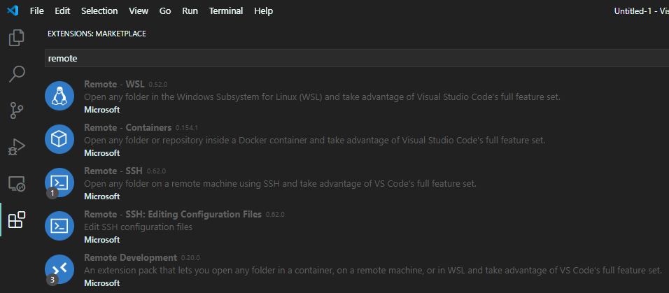

​	

일단 extension을 두 개 깔아줍니다. __Remote - SSH__ 와 __Remote Development__ 입니다.

설치하면 화면 좌측 하단에 연두색 버튼이 보입니다. 눌러줍니다.

​	

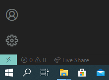

​	

__Remote-SSH: Connect Current Window to Host...__ 를 선택하고, 아래와 같이 입력합니다.

​	

```shell
ssh -i "~\...\kdt.pem" ubuntu@{퍼블릭 IP}

# 여기서 '~'는 'C\User\사용자' 입니다.
```

​	

이 후 __connect__ , __Linux__ 를 차례로 클릭하여 터미널을 열었을 때 아래의 화면이 보이면 최종적으로 완료 된 것입니다.

​	

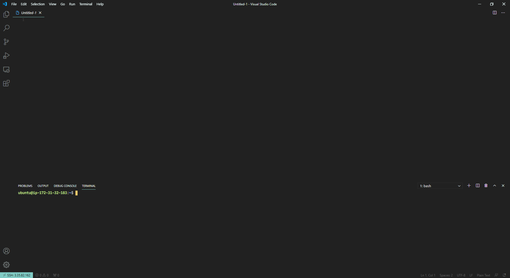