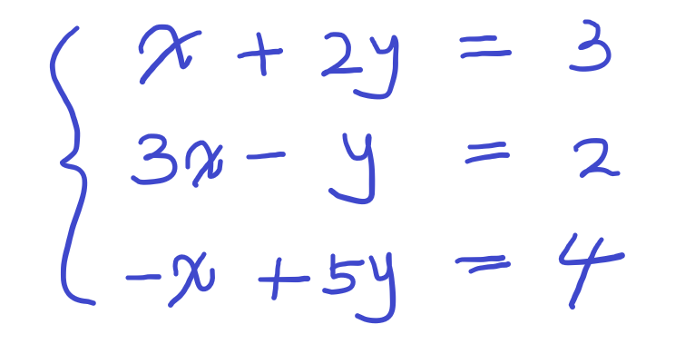
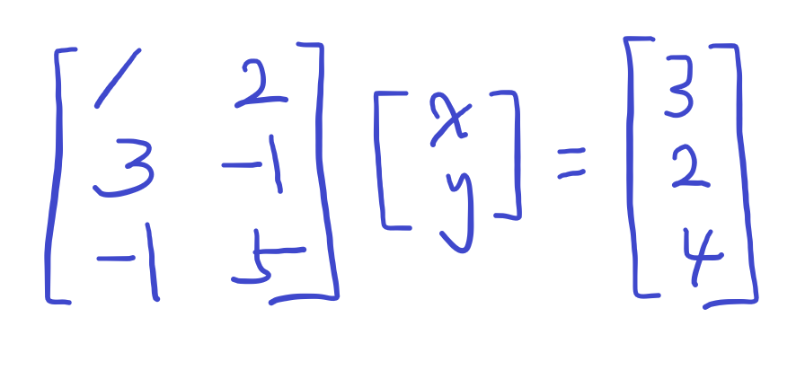

​	

### __A__ __x__ = __b__ 의 형태로 나타낼 수 있는 시스템이다.

a x = b를 선형 방정식이라고 한다.

여러 개의 선형 방정식을 연립하면 아래와 같다.

연립되는 식이 많아질수록 복잡해진다.

그래서 더 단순화하고 정형화 하기 위해 새로운 방법을 고안했다.

> 행렬을 사용해서 어떤 선형 연립식이든 __A__ __x__ = __b__ 의 형태로 만드는 방법이다.

위에서 나타낸 식은 아래와 같이 표현될 수 있다.

​	

__A__ 의 역행렬을 __b__ 행렬에 곱해서 __x__ 행렬을 구할 수 있다.

위와 같은 형태는 `3 X 2 linear system`이라고 한다.

3은 `연립식의 갯수`를 의미하고, 2는 `미지수의 갯수`를 의미한다.

식의 갯수가 미지수의 갯수 이상일 때 해당 시스템의 해가 있을 가능성이 생긴다.

가능성이라고 말한 이유는, __A__ 행렬의 역행렬이 존재하지 않을 가능성이 있기 때문이다.