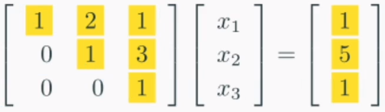
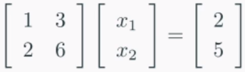
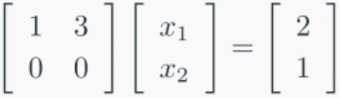
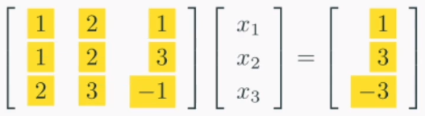
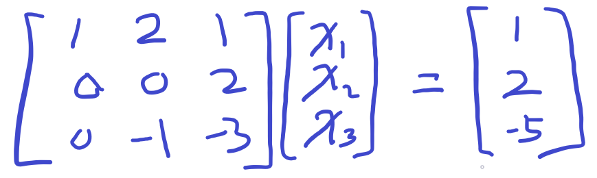
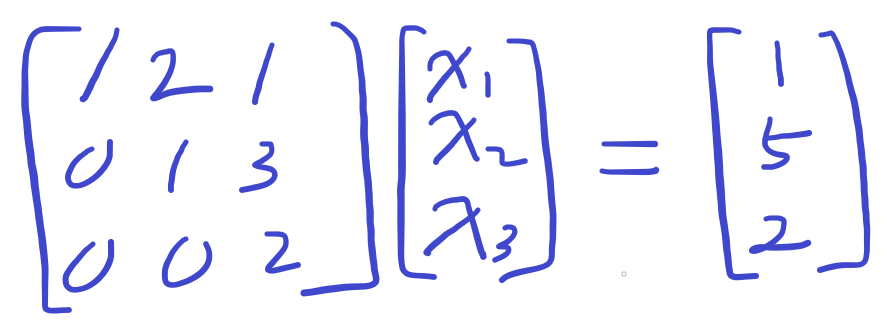
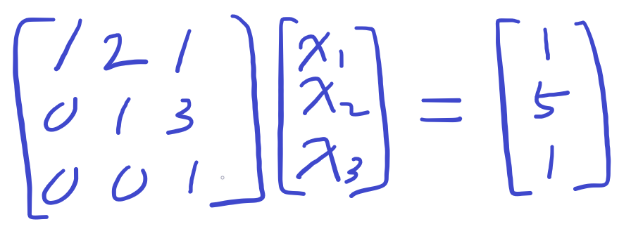

​	

# 가우스 소거법이란?
선형 시스템의 해를 구하는 대표적인 방법이다.
1. __Forward elimination(전방소거법)__

2. __back-substitution(후방대입법)__

  의 순서로 진행된다.

​	

## 전방소거법

​	

이랬던 선형시스템을

​	

​	

이렇게 바꿔주는 작업이다.

전방소거법을 수행하면 두 가지 장점이 있다.

1. __계산이 쉬워진다.__
2. __해가 있는지 판단할 수 있다.__

전방소거법 후 3행 -> 2행 -> 1행의 순서대로 계산을 하는 것이 __후방 대입법__ 이다.

미지수가 하나로 줄기 때문에 계산이 한결 편해진다.

또 해의 유무를 파악할 수 있다.

해가 없는 선형시스템의 예를 들면,

​	

​	

전방소거법 후,

​	

​	

와 같이 나타나는데, 2행의 식은 의미가 없다는 것을 알 수 있다.

​	

## 전방소거법 과정

​	

이 식을 전방소거법 해보자.

2행과 3행의 1열이 0이 되어야 하므로, 1행을 빼 0을 만든다.

​	

​	

2행 2열이 0이므로, 3행과 자리를 바꾼다.

그리고 -1을 곱해 1로 만든다.

​	

​	

마지막으로 3행 3열도 1로 만들어준다.

​	

​	

전방소거법의 과정이 체계적이고 정형화 되어있으므로 프로그램으로 구현하기 쉽다.