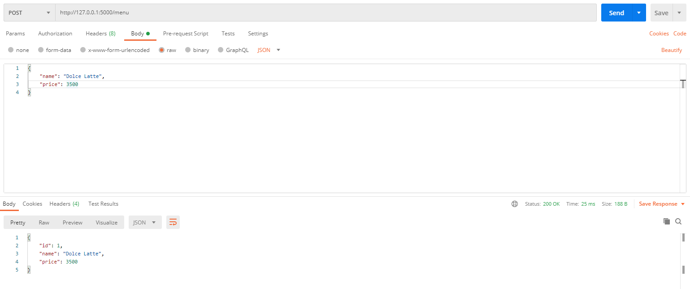
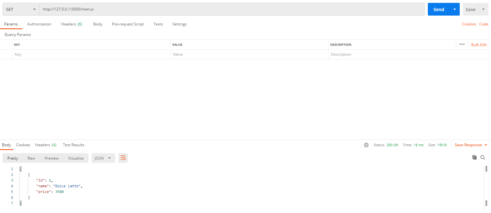
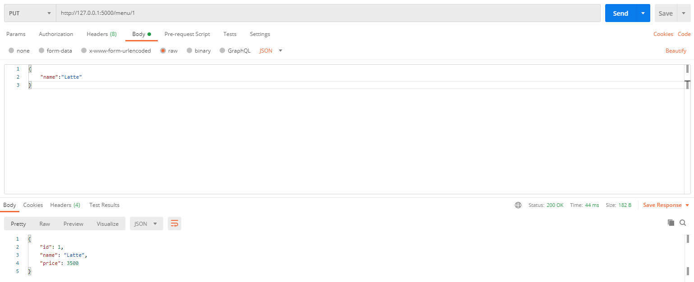
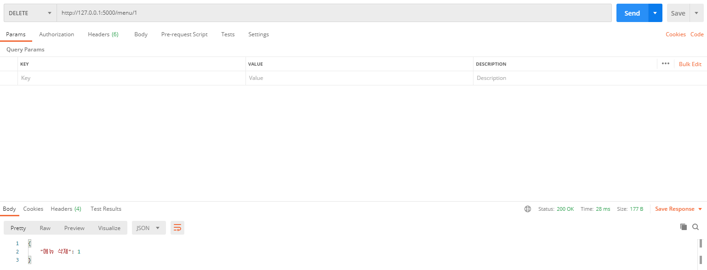

어느 카페에서의 메뉴판을 `CRUD`하려고 한다.

형식은 id, name, price로, `{id:1, name:'Americano', price:3800}`처럼 되어있으며, JSON형태로 반환한다.

`jsonify`와 `request`를 추가로 import해주자.

또한 데이터를 담을 menus 리스트를 만들어 놓는다.

```python
from flask import Flask, jsonify, request


menus = []    # [{id: 1, name: 'Americano', price: 3800}]
```

### Create

우선 주소는 `/menu`로 한다.

rest방식에 따라 create는 `POST` 메소드를 사용한다.

```python
@app.route('/menu', methods=['POST'])
def create_menu():
    # 전달받은 자료를 menus에 추가
    request_data = request.get_json()
    id = request_data['id']
    name = request_data['name']
    price = request_data['price']
    new_menu = {"id" : id, "name" : name, "price" : price}
    menus.append(new_menu)
    return jsonify(new_menu)
```

`request.get_json()` 메서드를 사용해서 전달받은 데이터를 JSON형태로 받을 수 있다.

여기서는 id, name, price에 대한 rowdata를 받았으나, 실제로는 id에 대한 값은 받지 않는 경우가 많으니 id를 자동 생성하는 알고리즘을 짜야한다.

아래와 같이 만들 수 있겠다.

```python
if len(menus) == 0:
    id = 1
else:
	id = menus[-1]['id'] + 1
```

새로 생성한 new_menu를 menus에 추가하고, JSON형태로 리턴한다.

Postman으로 입출력값을 확인하면 다음과 같다.




## Read

read는 `GET` 메서드이다.

`menus`가 리스트 형태이기 때문에, JSON형태로 바로 바꿀 수 없다.

그러므로 우선 딕셔너리 형태로 바꿔준 후 jsonify를 통해 JSON형태로 바꾼다.

```python
@app.route('/menus')
def get_menus():
    return jsonify("menus" : menus)
```

입력값은 없어도 되며, 방금 Dolce Latte를 생성했기 때문에 아래와 같은 출력이 나타난다.




## Update

update는 `PUT` 메서드이다.

update 할 데이터의 id값을 알아야 하기 때문에 주소는 `/menu/<int:id>`가 된다.

이 주소는 `/menu/1`와 같이 입력한다.

```python
@app.route('/menu/<int:id>', methods=['PUT'])
def update_menu(id):
    request_data = request.get_json()
    name = request_data['name']
    price = request_data['price']
    # id가 id인 메뉴 찾기
    update_menu = list(filter(lambda x: x['id'] == id, menus))[0]
    update_menu['name'] = name
    update_menu['price'] = price
    return jsonify(update_menu)
```

filter를 이용해 메뉴를 찾는다. (다른 방법이 더 좋다면 그리 해도 된다.)

그리고 그 메뉴의 name과 price를 업데이트 해주면 완료!




## Delete

filter를 이용해 해당 id값은 가진 데이터를 찾는다.

이후 remove 메서드를 이용해 리스트에서 삭제한다.

```python
@app.route('/menu/<int:id>', methods=['DELETE'])
def delete_menu(id):
	menus.remove(list(filter(lambda x: x['id'] == 1, menus))[0])
    return jsonify({"메뉴 삭제": id})
```

`GET`과 마찬가지로 입력값이 없어도 된다.

