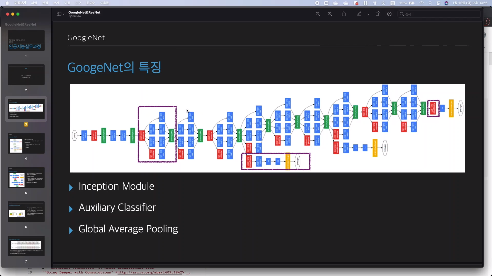
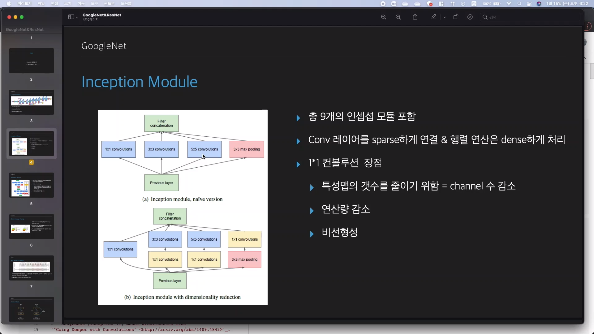
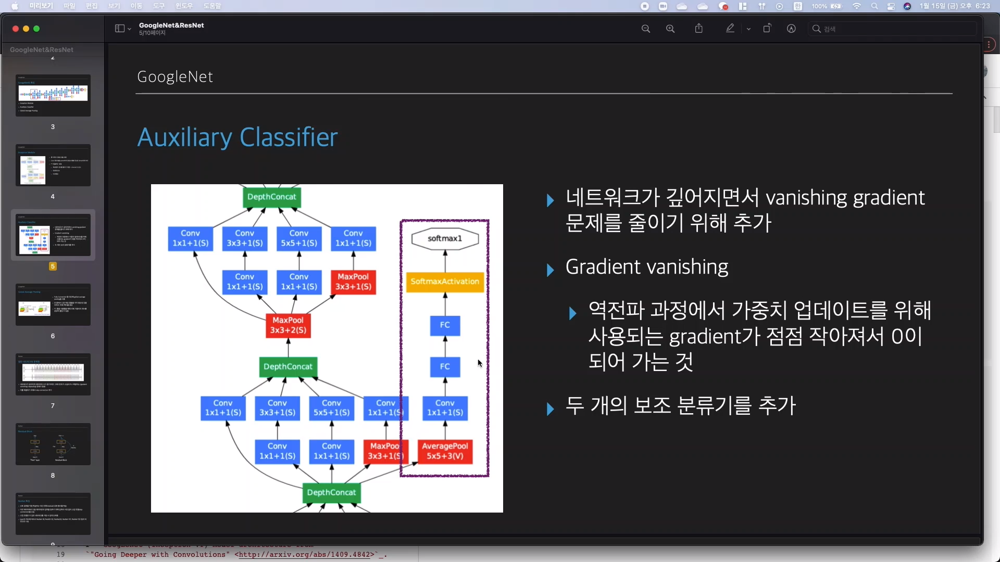
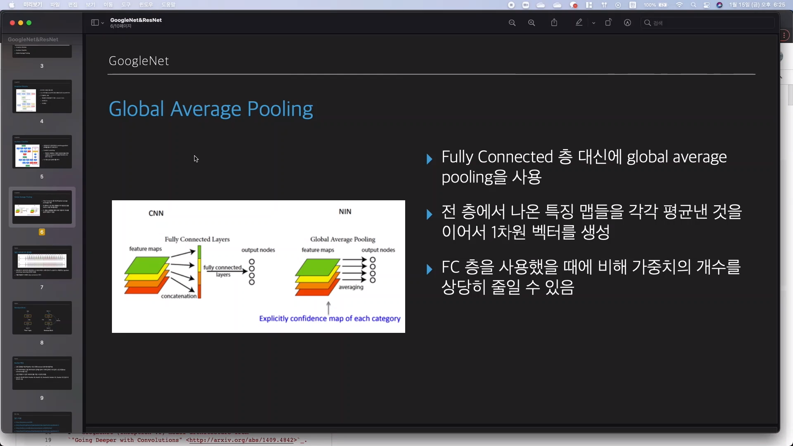

​	

## Google Net의 특징

- Inception Module
- Auxiliary Classifier
- Global Average Pooling

인셉션 모듈에서는 fiture를 효과적, 효율적으로 추출하기 위해 3가지의 convolution을 사용한다.

여러 개의 convolution을 사용하면 더 다양한 종류의 특징을 도출 할 수 있다.

deeplearning을 망이 깊어질수록 overfitting, gradiant venision이 생김.

그래서 googleNet에서는 인셉션 모듈을 conv 레이어는 sparse, 행렬 연산은 dense하게 처리

작은 conv 레이어를 사용해 진행하면 연살량이 매우 증가.

그래서 작은 conv를 유지하면서 1*1 conv를 사용해 연산량을 줄임.

### 보조 분류기

googleNet에 총 2개 있음.

신경망이 깊어질수록 gradient가 모든 레이어로 흘러가지 않음.

보조분류기를 사용하면 gradient가 0이 되는 것을 방지.

test에는 사용하지 않고 학습단계에서만 사용

fully connected 대신 global average ooling 사용

fully connected는 여러장의 feature map이 있으면 이를 기레 벡터로 연결해서 사용한다.

global average pooling은 각 feature map의 평균을 output node의 한개로 들어가게 된다. 그래서 가중치의 갯수를 훨씬 많이 줄일 수 있다.

