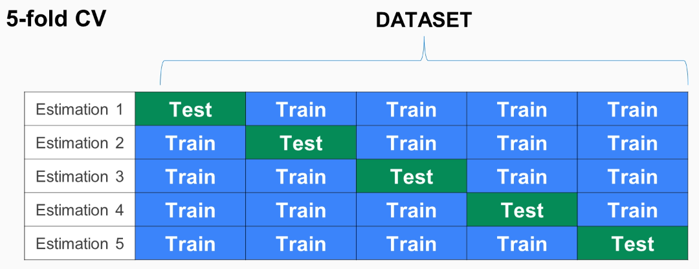

> 교차검증이란?
>
> 머신러닝의 평가 단계에서 자주 사용하는 검증방법이다.

​	

## 사용 목적

주어진 데이터를 학습할 때, 그 데이터를 `train`, `test`로 나누어 학습한다.  

이 때, `test`가 고정되어있으면 학습을 반복하면서 `test`에만 과적합된 결과가 나타날 수 있다.  

그래서 `train`과 `test`를 섞어주면서 훈련을 시키는데, 섞는 방법 중 대표적인 방법이 `cross validation`이다.

​	

## 동작법

​	

cross validation은 처음에 주어진 데이터를 k개로 나눈다. 위의 예시는 5개로 나눈 경우이다.  

Estimation1의 데이터 분배로 한 번 훈련시킨다.  

Estimation2의 데이터 분배로 또 한 번 훈련시킨다. 이를 반복하여 Estimation5까지 훈련한다.  

마지막으로, k개의 평가 지표를 평균내어서 

