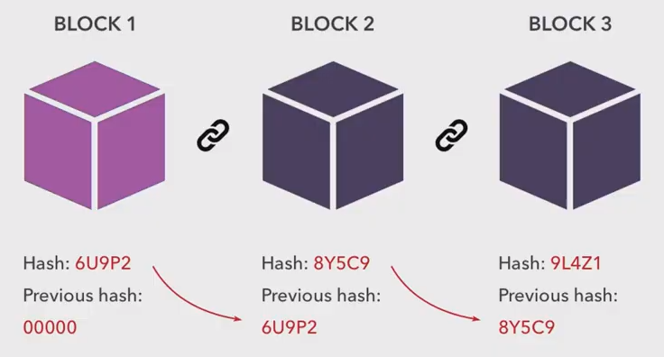
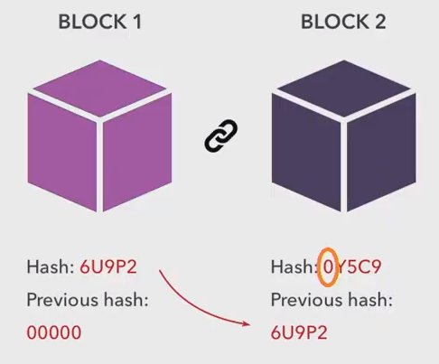
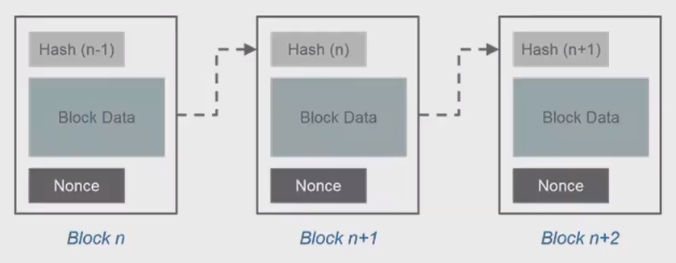

​	

## 0. Hash Function

Hash는 파이썬의 dict처럼 key값은 value값을 출력하지만, value는 key를 출력할 수 없는 성질을 이용하는 보안입니다.

만약 어느 사이트에서 패스워드를 입력하게 되면, 그에 해당되는 알수없는 key가 발급되는 경험이 있을 것이다.

(이때 salt를 친다고 표현함)

이때 발급되는 key는 패스워드를 추론할 수 없기 때문에 발급되는 key로는 패스워드를 찾아내기는 힘들다.

블록체인에서는 대부분의 값이 해싱값으로 되어있어 보안에 유리하다.

​	

## 1. Simple Blockchain

데이터가 변경되면, Block1의 hash값이 변하게 된다.

그러면 Block2에서 입력되는 해싱값이 변했다는 것을 알게 된다.

(여기서 Block1을 genesis block이라 한다.)

블록체인은 이렇게 해싱들이 엮여있는 것을 말한다.

따라서, 데이터를 수정할 수 없는 것이 아니라 데이터가 변경된 것을 알 수 있는 것이 블록체인이다.

​	

## Proof of Work

​	

## Nonce

해싱값을 조금씩 조정하다보면 0으로 시작하는 해싱값이 나온다.

Nonce를 1씩 올리면서 해싱값이 0으로 시작하면, 그 값을 Nonce라고 한다.

