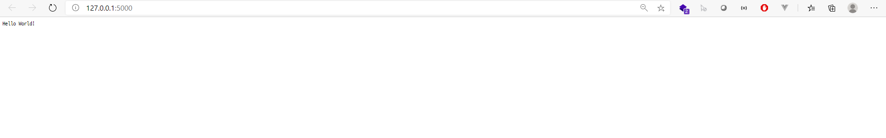

플라스크는 매우 간단하면서도 실속있는 마이크로 웹 프레임워크이다.


우선 Flask를 설치해야한다.

터미널에서 다음과 같이 입력한다.

```python
pip install flask
```

이후 파이썬 파일을 하나 만들고 아래와 같이 입력한다.

```python
# import flask
from flask import Flask

# flask create
app = Flask(__name__)

# main route
# 괄호안의 '/'는 상대주소를 의미한다.
@app.route('/')
def hello_flask():
    return "Hello World!"


if __name__ == '__main__':
    app.run()
```

이렇게 작성한 뒤 파일을 실행하면, `Hello World`라고 적힌 웹페이지가 만들어진다!



