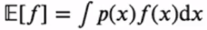
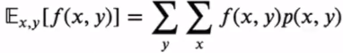
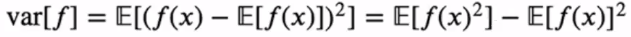
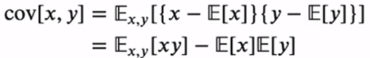
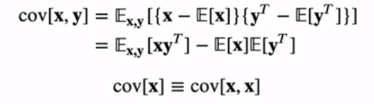

## 용어 정리

### 기댓값 (Expectations)

> 확률분포 p(x) 하에서 함수 f(x)의 평균값

연속확률분포에서 기댓값은 다음과 같다.

여러개 변수들의 함수에서 기댓값은,

### 분산 (variance)

> 함수의 값들이 기댓값으로부터 흩어져있는 정도

### 공분산 (covariance)

> 두 개의 확률변수 x, y에 대해 분산을 구할 때, 공분산이라고 한다.

확률변수의 벡터에 대한 공분산을 구하면,

벡터의 `T` (transfer)는 행벡터를 열벡터로 만들기 위해 사용한다.