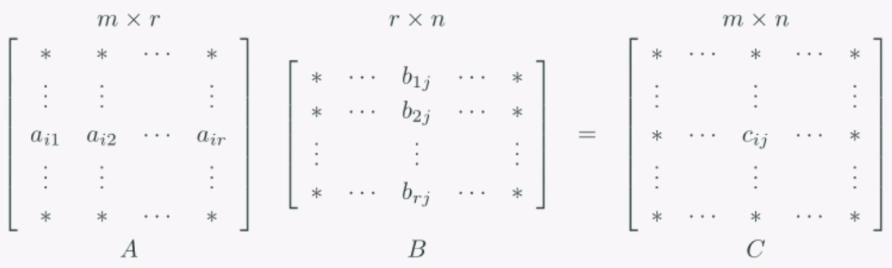
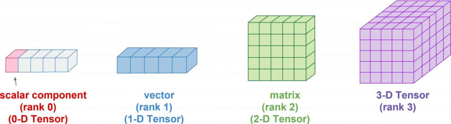
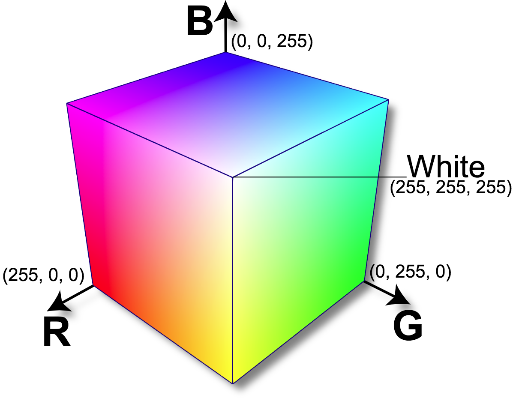
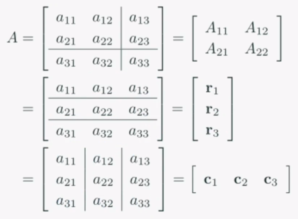
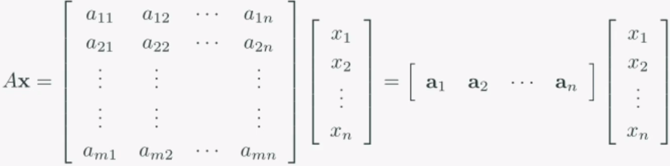

### 행렬의 곱은 병렬처리로 가속화할 수 있다.

두 행렬의 곱으로 만들어지는 행렬 __C__ 의 각 성분들은 독립적이라는 것을 뜻한다.

무슨 말이냐면, C11을 철수가 계산하고 C12를 영희가 계산해도 된다는 소리다.

컴퓨터가 행렬 계산을 할 때, 병렬연산을 사용하여 더욱 빠르게 계산을 할 수 있다.

### 텐서란? 스칼라 -> 벡터 -> 행렬
텐서는 데이터의 배열을 의미한다. 배열의 차원에 따라 스칼라, 벡터, 행렬의 형태로 변화한다.

| RANK | TYPE     | EXAMPLE            |
| ---- | -------- | ------------------ |
| 0    | scalar   | [1]                |
| 1    | vector   | [1 1]              |
| 2    | matrix   | [[1 1] [1 1]] |
| 3    | 3-tensor | ...                |

3-텐서의 예로 RGB 픽셀값을 들 수 있다.

### 분할행렬(Partitioned Matrix)

행렬을 여러개로 나누어도 계산에 아무 지장이 없다.

그림에서 맨 아래의 예시처럼, 행렬을 열 벡터들의 조합이라고 생각하면 계산이 편해지는 경우가 많다.

### 선형조합

__Ax__ 가 가지는 구조적인 의미는 각 벡터들에 대한 가중치의 합이다.

선형대수에서는 이를 선형조합(linear combination)이라고 부른다.