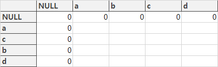
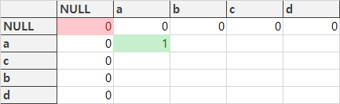
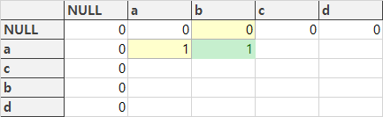
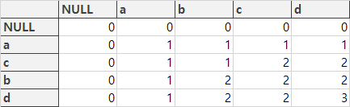

### LCS(Longest Common Subsequence)
LCS란, 두 개의 문자열 중에서 가장 긴 공통 수열을 찾는 알고리즘이다.

여기서 수열이란, 순서가 있는 문자열을 말한다. 예를들어,

str1 = 'abc'에서 모든 수열을 나열하면,

'a'

'ab'

'abc'

'ac' <- 중간의 문자는 건너뛸 수 있다.

'b'

'bc'

'c'

를 말한다.

### 어떤 문제에서 사용할까?
https://www.acmicpc.net/problem/1958

https://www.acmicpc.net/problem/5582

https://www.acmicpc.net/problem/9251

https://www.acmicpc.net/problem/9252

### 알고리즘
아래의 경우를 생각하며 알고리즘이 어떻게 진행되는지 알아보자.
> str1 = 'abcd'
> str2 = 'acbd'
> LCS(str1, str2)는 str1와 str2의 LCS이다.

- 만약 두 문자열의 마지막 문자가 같다면 해당 문자는 LCS에 포함시키는 것이 옳다.
따라서 'd'는 LCS에 포함되므로, LCS('abcd', 'acbd') == LCS('abc', 'acb') +1 이다.
- 이제 'abc'와 'acb'의 마지막 문자는 같지 않으므로,
LCS('abc', 'acb') 는 LCS('abc', 'ac')와 LCS('ab', 'acb') 중 큰 값과 동일하다.
- 만약 str1 또는 str2의 길이가 0이면, LCS(str1, str2)는 0이다.

이를 재귀를 이용해 나타내면 다음과 같이 표현할 수 있다.
```python
def LCS(str1, str2):
    # 빈 문자열이 들어가면 0을 반환
    if len(str1) == 0 or len(str2) == 0:
        return 0
    # 마지막 값이 같으면 LCS에 추가
    if str1[-1] == str2[-1]:
        return LCS(str1[:-1], str2[:-1]) + 1
    # 마지막 값이 다를 때의 로직
    else:
        return max(LCS(str1[:-1], str2), LCS(str1, str2[:-1]))
```
이 방법은 간단하지만 중복호출이 너무 많아진다는 단점이 있다. 따라서 DP를 이용해 중복호출을 방지해야한다.

DP를 사용하는 방법은 간단하다. 데이터를 저장하는 table을 만들어 순서대로 저장하는 방법이다.		
		


값이 없는 것은 0이므로 초기 테이블은 위와 같다.

테이블의 x, y 데이터는 LCS(str1[:x], str2[:y])와 같다.

a, a의 값은 마지막 값이 같으므로, LCS(str1[:1], str2[:1]) == LCS(str1[:0], str2[:0]) + 1 == 1이다.
		


a, b의 값은 마지막 값이 다르므로,
LCS(str1[:1], str2[:1]) 와 LCS(str1[:0], str2[:2]) 중 큰 값인 1이다.
		


테이블을 모두 채우면 아래와 같다.




이를 python 코드로 나타내면 다음과 같다.

```python
def LCS(str1, str2):
    len_str1 = len(str1)
    len_str2 = len(str2)
    # 테이블 생성
    table = [[0] * (len_str2+1) for _ in range(len_str1+1)]
    for i in range(1, len_str1+1):
        for j in range(1, len_str2+1):
            # 마지막 값이 같을때 왼쪽 위 값에 1을 추가한다.
            if str1[i-1] == str2[j-1]:
                table[i][j] = table[i-1][j-1] + 1
            # 마지막 값이 다를때 왼쪽과 위 값 중 큰 값을 선택한다.
            else:
                table[i][j] = max(table[i][j-1], table[i-1][j])
    return table[len_str1][len_str2]
```