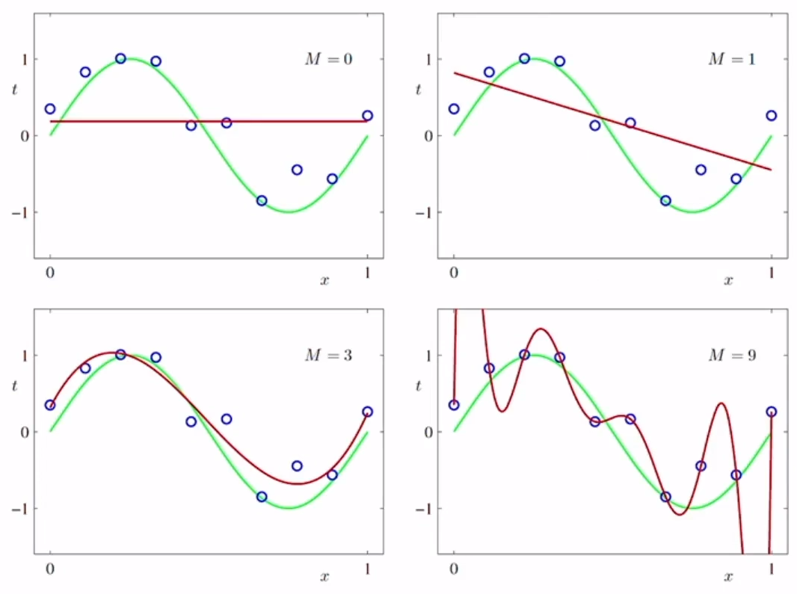
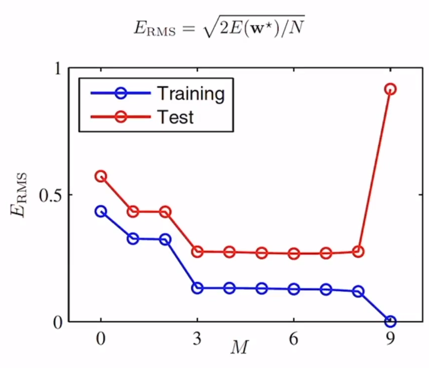

## 핵심개념들

- 학습단계 (training or learning phase): 함수를 학습데이터에 기반해 결정하는 단계
- 시험셋 (test set): 모델을 평가하기 위해서 사용하는 새로운 데이터가 아닌 이전에 접하지 못한 새로운 데이터에 대해 올바른 예측을 수행하는 역량
- 일반화 (generalization): 모델에서 학습에 사용된
- 지도학습 (supervised learning): target이 주어진 경우
  - 분류 (classification)
  - 회귀 (regression)
- 비지도학습 (unsupervised learning): target이 없는 경우
  - 군집 (clustering)

## 과소적합과 과대적합

M = 0일 때를 과소적합, M = 9일 때를 과대적합이라 한다.

M이 3 이상 부터는 오차의 변화가 별로 없다.

M이 9일때 오차의 범위가 급격히 줄어들지만 실제 test 데이터와는 큰 차이가 있다.