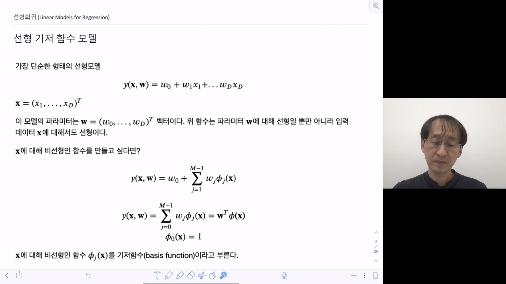
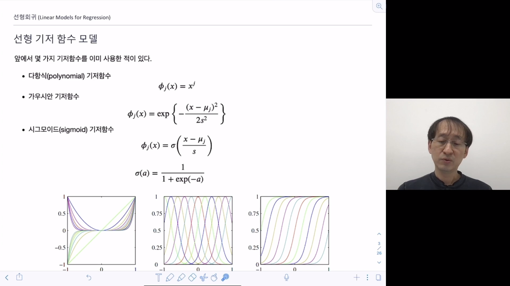
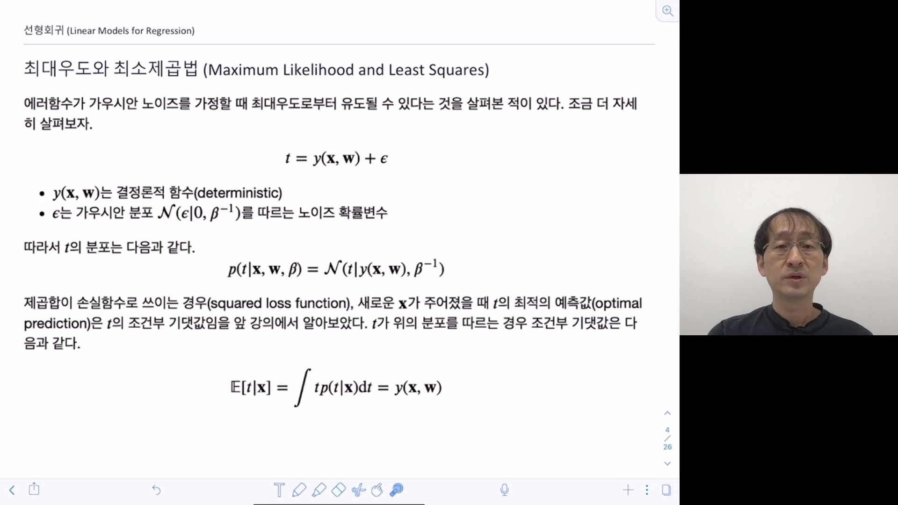
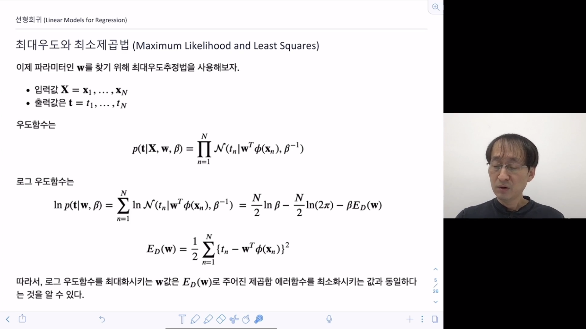
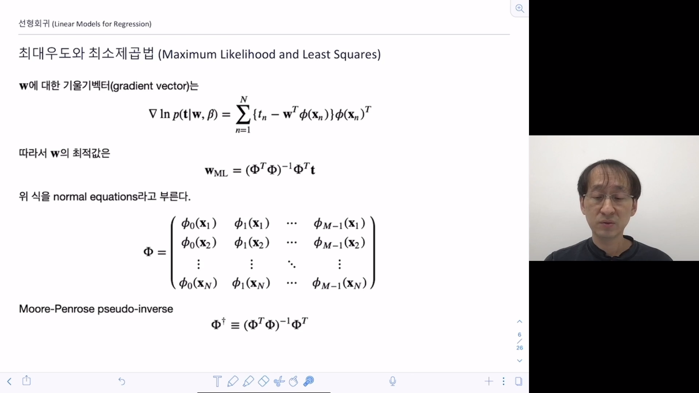
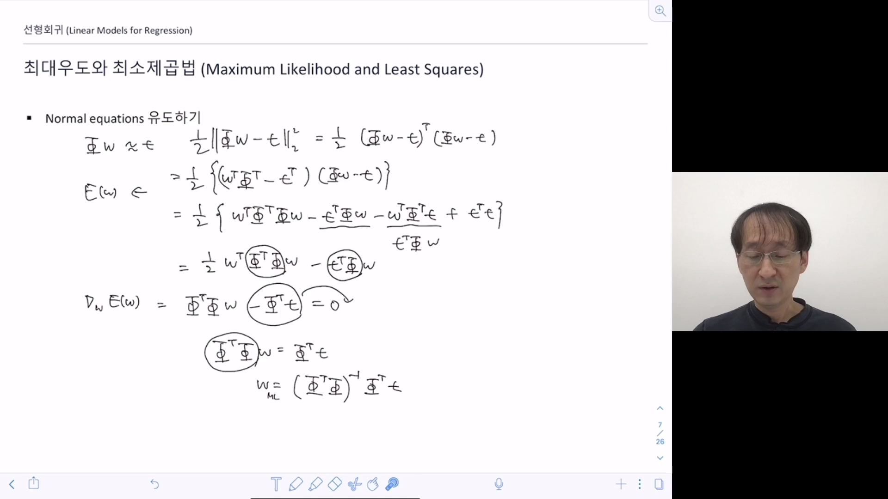
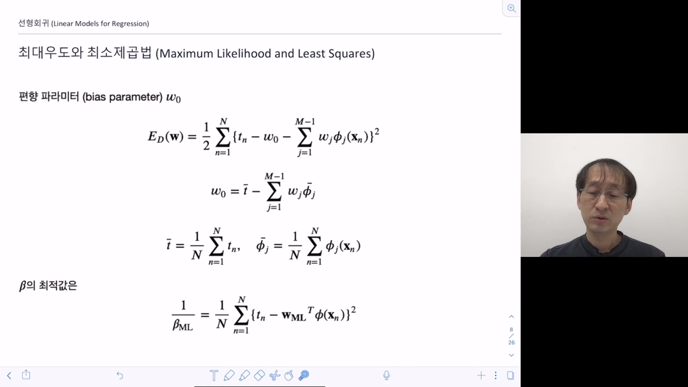
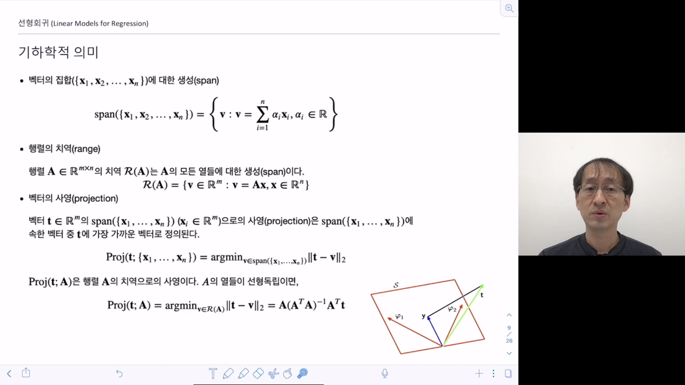
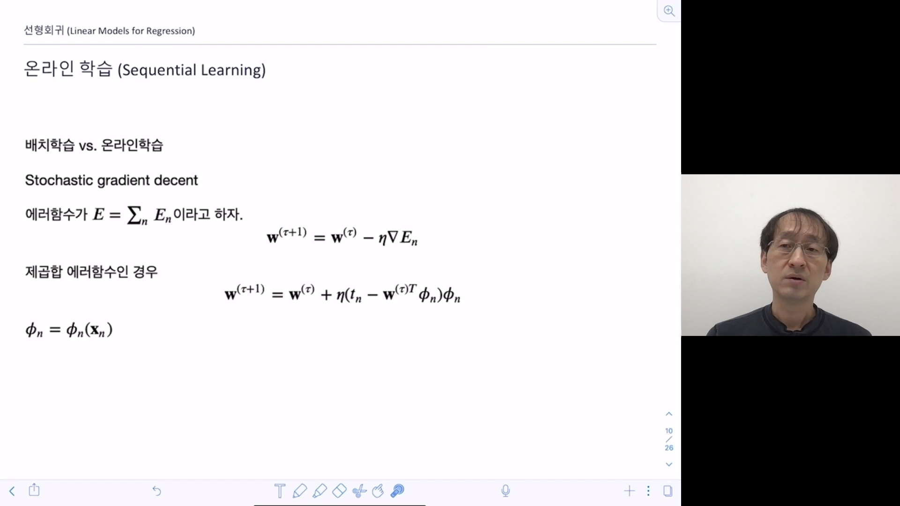
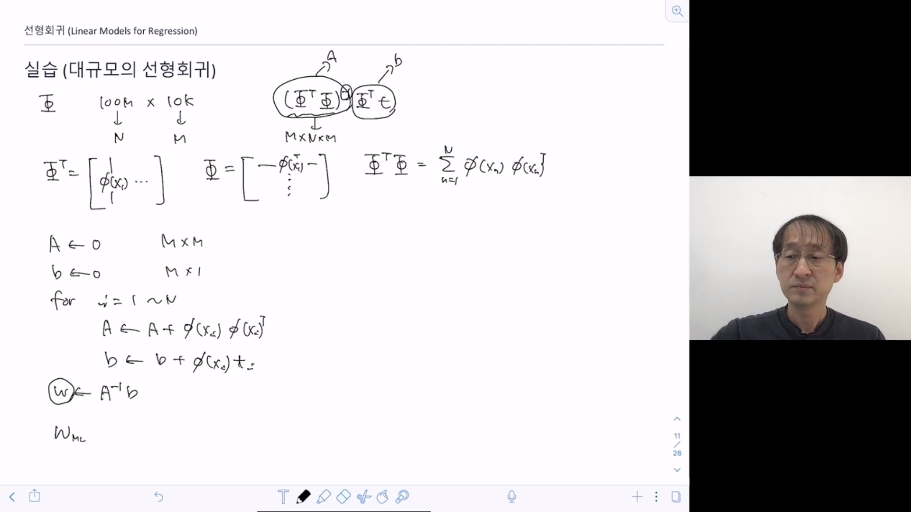

> 선형 모델은 빠르고, 좋은 성능을 가진다. 딥러닝을 이해하는 데에도 도움이 됨.

## 선형 기저 함수 모델

가장 단순한 형태의 선형 모델

만약 x에 대해 비선형인 모델을 만들고 싶다면, 기저함수를 곱해서 차원을 바꿔준다.

기억할 것은 x에 대해 비선형이지만 w에 대해서는 선형함수이다.

기저함수 안에 들어가는 x는 x1과 x2의 연산의 결과일 수 있다. ex) phi(x) = x1*x2

첫 번째 그림: 다항식 기저함수

두 번째 그림: 가우시안 기저함수

세 번째 그림 : 시그모이드 기저함수

## 최대우도와 최소제곱법

y는 deterministic이라 가정: y(x, w)는 고정된 값이라는 뜻

우리가 할 수 있는 일은 w의 최적의 값을 찾는 것!!

그럼 어떻게 구하는가?

w는 최대우도로 구할 수 있다.

x1는 벡터, t1은 스칼라

우도함수에서 X는 문맥상 생략하기도 한다.

결국 w의 최적값은 제곱합 에러함수를 최소화 시키는 값이다!

w의 최적값은 위와 같다.

일반적으로 phi는  열과 행이 매우 크게 다르기 때문에 수도inverse로 사용한다.

wML을 유도하는 공식

t bar는 목표값의 평균, phi bar는 phi에 x의 값들을 넣은 것들의 평균

## 기하학적 의미

벡터의 집합에 대한 생성은 이 벡터로 만들 수 있는 모은 벡터들의 집합을 의미한다.

행렬의 치역은 행렬의 벡터로 만들 수 있는 모든 벡터들의 집합을 의미한다.

Proj 식은 방금 구했던 phi로 구성된 식과 매우 유사함을 볼 수 있다.

이 것의 기하학적인 의미는 오른쪽 아래의 그림과 같이 목표값과 그나마 가장 가까운 벡터를 의미한다.

## 온라인 학습

데이터가 너무 커지면 계산이 힘들어질 수 있다.

그래서 온라인 학습은 사용

온라인 학습이란, 한번에 모든 데이터를 보고 계산하는 배치학습과는 달리, 데이터의 일부만 보고 갱신하는 방법이다.

### 실습

만약 아주 큰 데이터가 있을 때 선형회귀를 하는 법을 알아보자

