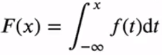
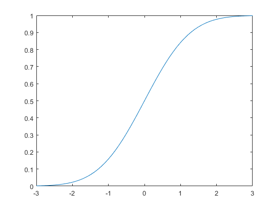
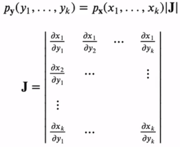
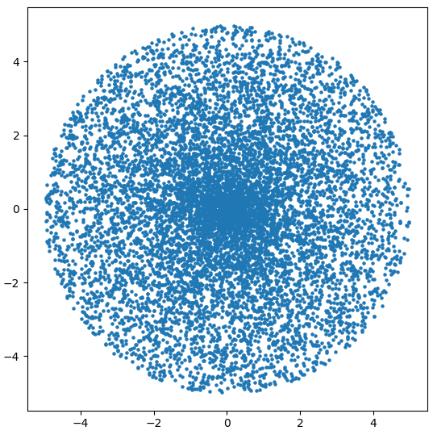
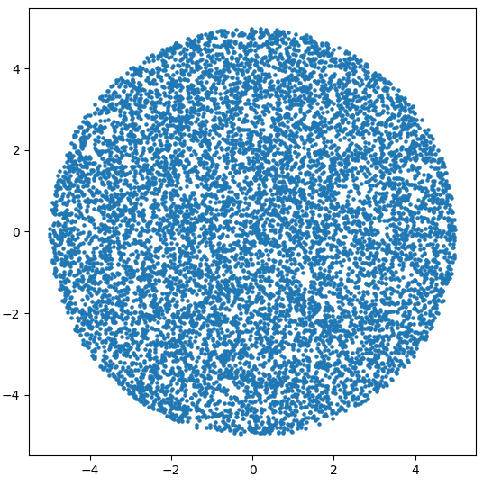

## 확률변수란?

확률변수 __X__ 는 표본의 집합 __S__ 의 원소 e를 실수값 __X(e)__ = x에 대응시키는 함수입니다.

예를들어, 6면체 주사위에서 '2'가 나올 확률은 1/6이 됩니다. 이 때, 확률변수 __X(2)__ 는 1/6입니다.

물론, __X(1) = X(2) = ... = X(6)__ = 1/6입니다.

### 연속확률변수

전세계 사람들의 키 데이터를 가지고 키가 170cm일 확률을 구한다고 해봅시다.

그런데 키가 정확히 170.00...cm인 사람은 존재하지 않기 때문에 0%에 수렴합니다.

이때 `누적분포함수`를 사용하여 확률변수를 표현하기도 합니다.

만약 확률변수 __X__ 를 아래의 __F(x)__ 처럼 나타낼 수 있다면, __X__ 를 연속확률변수라고 부르고, __f(x)__ 를 __X__ 의 확률밀도함수(pdf)라고 부른다.



#### 누적분포함수 (CDF. Cumulative Distribution Function)

누적분포함수란, 주어진 확률변수가 특정 값보다 작거나 같은 확률을 나타내는 함수입니다.



## 확률변수의 함수

k차원의 확률변수 벡터 __x__ = (x1, x2, ..., xk)가 존재할 때, yi = gi(x)인 __y__ = (y1, y2, ..., yk)가 있다고 합시다.

이 때 y의 결합확률밀도함수는 아래와 같습니다.



### 예제

회전좌표계를 이용하여 반경이 r인 원 안에 랜덤하게 점들을 찍는 프로그램을 만들어봅시다.

입력변수는 `theta`와 `distance`입니다.

```python
import matplotlib.pyplot as plt
import random
import math


plt.figure()
x = []
y = []
cnt = 0
radius = 5
while cnt <= 10000:
    theta = 2 * math.pi * random.random()
    distance = radius * random.random()
    x.append(distance * math.sin(theta))
    y.append(distance * math.cos(theta))
    cnt += 1
plt.scatter(x, y, s=5)
plt.show()
```


`theta`는 랜덤함수를 이용하여 간단히 구할 수 있습니다.

`distance`는 랜덤하게 구해버리면 가운데 점들이 몰려서 찍히는 현상이 발생합니다.



따라서, 점들을 균등히 분포시키기 위해 결합확률밀도함수를 구해야 합니다.

임의의 `distance`에 대한 원을 그리고, 그 원 안에 점이 들어갈 확률을 구하면, 

F(d) = d^2 / r^2

__F__ 의 역함수를 구하면, `F(u) = r * sqrt(u)`입니다.

이를 반영하여 코드를 수정하면,

```python
import matplotlib.pyplot as plt
import random
import math


plt.figure()
x = []
y = []
cnt = 0
radius = 5
while cnt <= 10000:
    theta = 2 * math.pi * random.random()
    distance = radius * (random.random()) ** 0.5
    x.append(distance * math.sin(theta))
    y.append(distance * math.cos(theta))
    cnt += 1
plt.scatter(x, y, s=5)
plt.show()
```



균일하게 분포되는 것을 볼 수 있습니다.