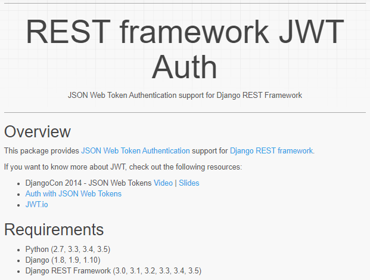

# Movie Review 리펙토링 - 객체지향

> 리펙토링에 사용되는 코드는 제 첫 프로젝트인 `영화 커뮤니티 사이트` 입니다.
>
> 본 리펙토링 과정은 3 단계로 진행할 예정이며 객체지향, 테스트코드, 아키텍쳐 순으로 진행합니다.
>
> 객체지향의 의미를 생각하며 코드 리뷰 및 리펙토링을 진행합니다.


## 사전 설명

### 기술 스택

해당 프로젝트의 `Back-end` 시스템을 리펙토링 합니다.

사용된 기술은 다음과 같습니다.

- Django
- Django Rest Framework
- JWT


### 프로젝트 설명

영화 데이터를 스크래핑하여 DB에 저장하고 이를 바탕으로 한 커뮤니티 사이트 입니다.

대략적으로 다음과 같은 코드 구조로 이루어져있습니다.

1. 유저 데이터 CRUD
2. 영화 데이터 스크랩
3. 영화 데이터 CRUD
4. 영화 평점 CRUD
5. 영화 댓글 CRUD
6. 영화 좋아요

모델과 뷰에 대한 자세한 설명은 리펙토링 과정에서 이루어집니다.


## Accounts (User 관리)

### models

```python
# accounts.models
from django.db import models
from django.contrib.auth.models import AbstractUser


class User(AbstractUser):
    username = models.CharField(primary_key=True, max_length=50)
```

`User` 는 커뮤니티 사용자를 의미합니다.

`AbstractUser` 에 기본적인 User fields가 존재하기 때문에 User의 field는 다음과 같습니다.

```
password, last_login, is_superuser, first_name, last_name, email, is_staff, is_active, date_joined, username
```


### urls

__before__

```python
# accounts.urls
from django.urls import path
from . import views

from rest_framework_jwt.views import obtain_jwt_token, refresh_jwt_token, verify_jwt_token

urlpatterns = [
    path('get-users/', views.get_users),
    
    path('signup/', views.signup),
    path('api-token-auth/', obtain_jwt_token),
    path('token-verify/', refresh_jwt_token),
    path('token-refresh/', verify_jwt_token),

    path('user_update_delete/', views.user_update_delete),
    path('profile/', views.profile),
]
```

URI의 상태가 __RESTful__과는 거리가 멀어 수정할 여지가 있습니다.

- 모든 `User` 의 목록을 반환: `get-users/` -> `GET users/`
- 새로운 `User` 를 생성(회원가입): `signup/` -> `POST users/`
- `User` 데이터를 변경 또는 삭제: `user_update_delete/` -> `PATCH users/{user_id}`, `DELETE users/{user_id}`
- 한 `User` 의 데이터를 반환: `profile` -> `GET users/{user_id}`

또한 본 코드에서는 `djangorestframework-jwt` 를 이용해 __authorization__ 처리를 했으나, 이 라이브러리는 최신버전의 __python, Django, DRF__를 지원하지 않습니다.[Django REST framework JWT (jpadilla.github.io)](https://jpadilla.github.io/django-rest-framework-jwt/) 



따라서 __DRF__ 공식문서에서 제안하는 `djangorestframework-simplejwt` 로 대체하고자 합니다.


새로운 URI를 적용한 코드는 다음과 같습니다.

__after__

```python
# accounts.urls
from django.urls import path
from . import views

from rest_framework_jwt.views import obtain_jwt_token, refresh_jwt_token, verify_jwt_token


urlpatterns = [
    path('users/', views.UserList.as_view()),
    path('users/<int:user_pk>', views.UserDetail.as_view()),

    # 임시적으로 JWT authentication, authorization 미적용
]
```

기존 `get-users/`, `signup/`, `user_update_delete/`, `profile/` 로 구분된 URI가 `users/`와 `users/{user_id}/` 로 응축되었습니다. 또한 자원중심적인 URI로 __RESTful__ 에 더 알맞다고 할 수 있습니다.

__CBV__ 의 이름 `UserList`와 `UserDetail`은 __DRF__ 공식 문서에서 사용한 예제를 바탕으로 만든 것으로, 도메인에 맞는 직관적인 이름이 아닐 수 있습니다. [3 - Class based views - Django REST framework (django-rest-framework.org)](https://www.django-rest-framework.org/tutorial/3-class-based-views/)  
좀 더 경험을 쌓고 더 좋은 네이밍을 떠올려 적용해보려고 합니다.

참고로, `simplejwt`의 구현은 __accounts.views __리펙토링 이후에 진행합니다.


### views

#### User 목록 반환, 회원가입

__before__

```python
# User 목록 반환
@api_view(['GET'])
def get_users(request):
    users = User.objects.all()
    serializer = UserSerializer(users, many=True)
    return Response(serializer.data)
```

```python
# 회원가입
@api_view(['POST'])
def signup(request):
    password = request.data.get('password')
    password_confirmation = request.data.get('passwordConfirmation')
		
    if password != password_confirmation:
        return Response({'error': '비밀번호가 일치하지 않습니다.'}, status=status.HTTP_400_BAD_REQUEST)
		
    serializer = UserSerializer(data=request.data)
    
    if serializer.is_valid(raise_exception=True):
        user = serializer.save()
        user.set_password(request.data.get('password'))
        user.save()
    return Response(serializer.data, status=status.HTTP_201_CREATED)
```

하나의 객체에서 __GET, POST__ 요청을 모두 처리하기 위해 위의 두 함수를 하나의 __CBV(Class Based View)__ 로 통합합니다.

이 때 __CBV__ 로 작성하는 방법에는 세 가지가 있는데 각각 소개하겠습니다.


__after 1 (APIView 사용)__

```python
from rest_framework.views import APIView

class UserList(APIView):
    """
    모든 User 목록을 반환하거나, 새로운 User를 등록할 수 있습니다.
    """

    def get(self, request):
        User = get_user_model()
        users = User.objects.all()
        serializer = UserSerializer(users, many=True)
        return Response(serializer.data)

    def post(self, request):
        password = request.data.get('password')
        password_confirmation = request.data.get('passwordConfirmation')
        if password != password_confirmation:
            res = Response({'error': '비밀번호가 일치하지 않습니다.'},
                           status=status.HTTP_400_BAD_REQUEST)
            return res
            
        serializer = UserSerializer(data=request.data)
        if serializer.is_valid(raise_exception=True):
            user = serializer.save()
            user.set_password(password)
            user.save()
        return Response(serializer.data, status=status.HTTP_201_CREATED)
```

객체 하나에서 __GET, POST__ 를 분기하여 처리가 가능합니다.


__after 2 (Mixin 사용)__

```python
from rest_framework import mixins, generics

class UserList(mixins.ListModelMixin,
               mixins.CreateModelMixin,
               generics.GenericAPIView):
    User = get_user_model()
    queryset = User.objects.all()
    serializer_class = UserSerializer

    def get(self, request, *args, **kwargs):
        return self.list(request, *args, **kwargs)
    
    def post(self, request, *args, **kwargs):
        return self.create(request, *args, **kwargs)
```

__GenericAPIView__ 를 이용하면 __Mixin__ 을 이용해 코드를 간결하게 만들 수 있습니다.

각 `Mixin`의 역할은 다음과 같습니다.

- __ListModelMixin__ : `get` 메서드에서 해당 object 전체를 반환합니다.
- __CreateModelMixin__ : `post` 메서드에서 해당 object를 생성합니다.

__GenericAPIView__ 는 `queryset`, `serializer_class`, 필요에 따라서는 `lookup_field`, `lookup_url_kwarg` 를 설정하여 사용합니다. 참고자료:[django-rest-framework/generics.py at master · encode/django-rest-framework (github.com)](https://github.com/encode/django-rest-framework/blob/master/rest_framework/generics.py)

또한 해당 링크에서 __Mixin__ 의 소스코드를 볼 수 있습니다. [django-rest-framework/mixins.py at master · encode/django-rest-framework (github.com)](https://github.com/encode/django-rest-framework/blob/master/rest_framework/mixins.py)


__after 3 (generic view 사용)__

```python
class UserList(generics.ListCreateAPIView):
    User = get_user_model()
    queryset = User.objects.all()
    serializer_class = UserSerializer
```

__ListCreateAPIView__ 제네릭 뷰를 이용하면 그보다 더 간결한 코드가 작성됩니다.  
일반적인 목록조회와 객체생성 기능이 손쉽게 가능한 장점이 있지만 기존 코드( __password confirmation__ )를 적용하는데 어려움이 있습니다.

따라서 __Mixin__ 과 __Generic View__ 를 적절히 조합하여 리펙토링을 진행합니다.


__after final__

```python
class UserList(mixins.CreateModelMixin,
               generics.ListAPIView):
    """
    모든 User 목록을 반환하거나, 회원가입을 합니다.
    """

    User = get_user_model()
    queryset = User.objects.all()
    serializer_class = UserSerializer

    def post(self, request, *args, **kwargs):
        password = request.data.get('password')
        password_confirmation = request.data.get('passwordConfirmation')
        if password != password_confirmation:
            return Response({'error': '비밀번호가 일치하지 않습니다.'},
                            status=status.HTTP_400_BAD_REQUEST)
        return self.create(request, *args, **kwargs)
```

__generic view__ 를 최대한 이용하면서 __password confirmation__ 을 검사할 수 있습니다.


#### 프로필 보기, 회원정보 변경, 회원탈퇴

__before__

```python
# 프로필 보기
@api_view(['GET'])
@authentication_classes([JSONWebTokenAuthentication])
@permission_classes([IsAuthenticated])
def profile(request):
    User = get_user_model()
    person = get_object_or_404(User, username=request.user)
    serializer = UserSerializer(person)
    return Response(serializer.data)
```

```python
# 회원정보 변경, 회원탈퇴
@api_view(['PUT', 'DELETE'])
def user_update_delete(request):
    if request.method == 'PUT':
        #1-1. Client에서 온 데이터를 받아서
        old_password = request.data.get('oldPassword')
            
        #1-2. 패스워드 일치 여부 체크
        if old_password != request.user.password:
            return Response({'error': '이전 비밀번호가 일치하지 않습니다.'}, status=status.HTTP_400_BAD_REQUEST)
            
        #2. UserSerializer를 통해 데이터 직렬화
        serializer = UserSerializer(data=request.data)
        
        #3. validation 작업 진행 -> password도 같이 직렬화 진행
        if serializer.is_valid(raise_exception=True):
            user = serializer.save()
            #4. 비밀번호 해싱 후 
            user.set_password(request.data.get('newPassword'))
            user.save()
        # password는 직렬화 과정에는 포함 되지만 → 표현(response)할 때는 나타나지 않는다.
        return Response(serializer.data, status=status.HTTP_201_CREATED)
    else:
        user = User.objects.get(pk=request.user)
        user.delete()
        return Response({'id가 삭제되었습니다'}).
```

앞서 만들었던 `UserList` 클래스의 경우와 마찬가지로, __CBV__ 로 통합하여 __Request Method__ 로 구분합니다.


__after 1 (APIView 사용)__

```python
class UserDetail(APIView):
    """
    User의 프로필 보기, 회원정보수정, 회원탈퇴를 합니다.
    """

    def _get_object(self, username: str):
        User = get_user_model()
        return get_object_or_404(User, username=username)
            
    def get(self, request, username: str):
        user = self._get_object(username)
        serializer = UserSerializer(user)
        return Response(serializer.data)

    @authentication_classes([JSONWebTokenAuthentication])
    @permission_classes([IsAuthenticated])
    def patch(self, request, username: str):
        old_password = request.data.get('oldPassword')
        new_password = request.data.get('newPassword')
        if old_password != request.user.password:
            res = Response({'error': '비밀번호가 일치하지 않습니다.'},
                           status=status.HTTP_400_BAD_REQUEST)
            return res

        user = self._get_object(username)
        serializer = UserSerializer(user, data=request.data, partial=True)
        if serializer.is_valid(raise_exception=True):
            user = serializer.save()
            if new_password:
                user.set_password(new_password)
                user.save()
        return Response(serializer.data, status=status.HTTP_201_CREATED)
    
    @authentication_classes([JSONWebTokenAuthentication])
    @permission_classes([IsAuthenticated])
    def delete(self, request, username: str):
        user = self._get_object(username)
        if user != request.user:
            res = Response({'error': '사용자가 일치하지 않습니다.'},
                           status=status.HTTP_401_UNAUTHORIZED)
        user.delete()
        res = Response({'success': f"'{username}' 유저가 삭제되었습니다."})
        return res
```

여기서는 기존 `put` 메서드를 `patch` 로 변경하였습니다. 데이터를 새롭게 덮어 씌우는 것보다 수정할 부분만 변경하는 것이 요청의 목적 더 어울린다고 생각하기 때문입니다. (또 password데이터 전송이 없어 보안에 더 유리하고, 트레픽 절약도 됩니다.)

이를 __generic view__ 와 __Mixin__ 을 이용하여 리펙토링 합니다.

그런데, __DRF__ 에서 `patch` 를 위한 __Mixin__ 은 없기 때문에 새롭게 만들어서 적용합니다.


```python
from rest_framework.permissions import IsAuthenticated
from rest_framework_jwt.authentication import JSONWebTokenAuthentication
from .models import User
from django.shortcuts import get_object_or_404
from rest_framework import status
from rest_framework.decorators import api_view, authentication_classes, permission_classes
from rest_framework.response import Response
from .serializers import UserSerializer
from django.contrib.auth import get_user_model


@api_view(['GET'])
@authentication_classes([JSONWebTokenAuthentication])
@permission_classes([IsAuthenticated])
def profile(request):
    User = get_user_model()
    person = get_object_or_404(User, username=request.user)
    serializer = UserSerializer(person)
    return Response(serializer.data)


# 유저정보 가져오기
@api_view(['GET'])
def get_users(request):
    users = User.objects.all()
    serializer = UserSerializer(users, many=True)
    return Response(serializer.data)


@api_view(['POST'])
def signup(request):
	#1-1. Client에서 온 데이터를 받아서
    password = request.data.get('password')
    password_confirmation = request.data.get('passwordConfirmation')
		
	#1-2. 패스워드 일치 여부 체크
    if password != password_confirmation:
        return Response({'error': '비밀번호가 일치하지 않습니다.'}, status=status.HTTP_400_BAD_REQUEST)
		
	#2. UserSerializer를 통해 데이터 직렬화
    serializer = UserSerializer(data=request.data)
    
	#3. validation 작업 진행 -> password도 같이 직렬화 진행
    if serializer.is_valid(raise_exception=True):
        user = serializer.save()
        #4. 비밀번호 해싱 후 
        user.set_password(request.data.get('password'))
        user.save()
    # password는 직렬화 과정에는 포함 되지만 → 표현(response)할 때는 나타나지 않는다.
    return Response(serializer.data, status=status.HTTP_201_CREATED)


@api_view(['PUT', 'DELETE'])
def user_update_delete(request):
    if request.method == 'PUT':
        #1-1. Client에서 온 데이터를 받아서
        old_password = request.data.get('oldPassword')
            
        #1-2. 패스워드 일치 여부 체크
        if old_password != request.user.password:
            return Response({'error': '이전 비밀번호가 일치하지 않습니다.'}, status=status.HTTP_400_BAD_REQUEST)
            
        #2. UserSerializer를 통해 데이터 직렬화
        serializer = UserSerializer(data=request.data)
        
        #3. validation 작업 진행 -> password도 같이 직렬화 진행
        if serializer.is_valid(raise_exception=True):
            user = serializer.save()
            #4. 비밀번호 해싱 후 
            user.set_password(request.data.get('newPassword'))
            user.save()
        # password는 직렬화 과정에는 포함 되지만 → 표현(response)할 때는 나타나지 않는다.
        return Response(serializer.data, status=status.HTTP_201_CREATED)
    else:
        user = User.objects.get(pk=request.user)
        user.delete()
        return Response({'id가 삭제되었습니다'})
```


